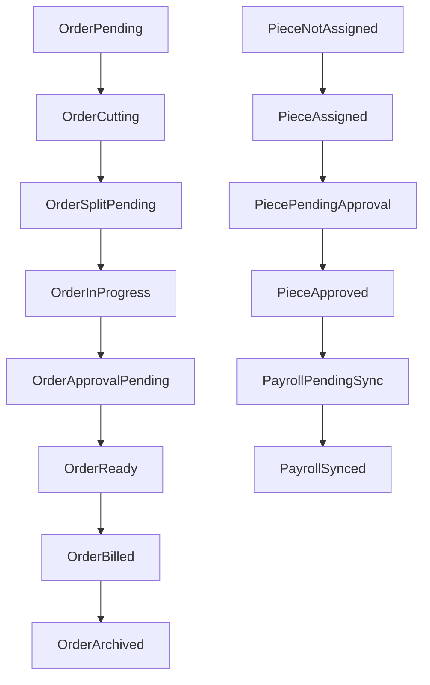

# Data Model Upgrade (Schema First)

## Scope
This schema update is designed for the current backend structure in [`server/api/_lib/constants.js`](server/api/_lib/constants.js) and route flow in [`api/index.js`](api/index.js), and only covers storage design (no API/UI implementation yet).

## Design Principles
- Images are optional metadata everywhere (order/cutting/completion).
- Product-rate model is normalized: Product header + SubProduct worker rates.
- Piece lifecycle is explicit and auditable (cut -> assigned -> pending_approval -> approved -> payroll_synced).
- Payroll visibility is controlled by sync state, not by completion state alone.
- Billing/archive is explicit at order and piece level for clean active dashboards.

## Updated / New Sheets

### 1) `Users` (existing)
Keep existing columns:
- `username`, `password`, `role`, `display_name`, `entity_id`

Notes:
- `role` continues platform access role (`admin`, `cutting`, `karigar`, `shop`).
- Worker craft skill is modeled in `Karigar` table (below), not `Users`.

### 2) `Karigar` (existing, expanded)
Current has `karigar_id`, `name`, `contact`, `created_date` (+ currently used `skills`).

Proposed columns:
- `karigar_id` (PK)
- `name`
- `contact`
- `skills` (CSV or normalized token list: `coat,pant,waistcoat`)
- `is_active` (`TRUE`/`FALSE`)
- `created_date`
- `updated_date`

Purpose:
- Enables role-based assignment filtering (Coat Maker/Pant Maker/Both).

### 3) `Products` (existing, kept as product header)
Current already matches required shape.

Columns:
- `product_id` (PK)
- `product_name` (example: `3-Piece VIP`)
- `shop_name` (example: `Royal`)
- `shop_rate`
- `is_active` (`TRUE`/`FALSE`)  **(new)**
- `created_date` **(new)**
- `updated_date` **(new)**

Purpose:
- Dynamic admin-managed product catalog and shop-facing rate basis.

### 4) `ProductSubProducts` (existing, expanded)
Current has `sub_id`, `product_id`, `sub_product_name`, `worker_rate`.

Columns:
- `sub_id` (PK)
- `product_id` (FK -> `Products.product_id`)
- `sub_product_name` (example: `coat`, `pant`, `waistcoat`)
- `worker_rate`
- `required_skill` (example: `coat`, `pant`, `waistcoat`) **(new)**
- `sequence_no` (int for deterministic display/extract ordering) **(new)**
- `is_active` (`TRUE`/`FALSE`) **(new)**

Purpose:
- Defines split logic and worker rate by sub-product.

### 5) `Orders` (existing, expanded for workflow + archive)
Current columns include `slip_photo_url`, `status`, `is_archived`, `billed_date`.

Proposed columns:
- `order_id` (PK)
- `order_number`
- `shop_id`
- `delivery_date`
- `priority_rank` **(new; derived for due-date sorting snapshots)**
- `designing_enabled`
- `designing_shop_charge`
- `slip_photo_url` (optional)
- `status` (`pending`, `cutting`, `split_pending`, `in_progress`, `approval_pending`, `ready`, `billed`, `archived`)  **(expanded enum)**
- `is_split` (`TRUE`/`FALSE`) **(new)**
- `split_date` **(new)**
- `is_billed` (`TRUE`/`FALSE`) **(new; replaces implicit-only archive logic)**
- `invoice_id` (FK nullable -> `ShopInvoices.invoice_id`) **(new)**
- `is_archived` (`TRUE`/`FALSE`)
- `billed_date`
- `created_date`
- `updated_date`

Purpose:
- Explicitly tracks split, billing, and archive lifecycle.

### 6) `OrderItems` (existing, small normalization)
Current columns include `measurement_photo_url`.

Proposed columns:
- `item_id` (PK)
- `order_id` (FK)
- `product_id` (FK -> `Products.product_id`) **(new, replace ambiguous `piece_type` lookup)**
- `item_type`
- `piece_type` (legacy compatibility; optional transitional)
- `status`
- `item_rate`
- `measurement_photo_url` (optional)
- `created_date` **(new)**
- `updated_date` **(new)**

Purpose:
- Ensures extraction uses stable product ID rather than name matching.

### 7) `Pieces` (existing, major lifecycle/finance expansion)
This is the core workflow ledger.

Proposed columns:
- Identity/links:
  - `piece_id` (PK)
  - `item_id` (FK)
  - `order_id` (FK)
  - `product_id` (FK) **(new)**
  - `sub_product_id` (FK -> `ProductSubProducts.sub_id`) **(new)**
- Product semantics:
  - `piece_name`
  - `sub_product_name`
  - `bundle_piece_type`
  - `item_type`
- Cutting step:
  - `cutting_done` (`TRUE`/`FALSE`)
  - `cutting_by`
  - `cutting_date`
  - `cutting_photo_url` (optional)
  - `cutting_credit_amount` **(new; from settings/rate engine)**
  - `cutting_credit_synced` (`TRUE`/`FALSE`) **(new)**
- Assignment step:
  - `assigned_karigar_id`
  - `assigned_role` **(new; resolved skill at assignment time)**
  - `assigned_date`
- Worker completion/approval step:
  - `karigar_status` (`not_assigned`, `assigned`, `pending_approval`, `approved`, `rejected`) **(expanded, replace direct complete path)**
  - `karigar_complete_date` (request timestamp)
  - `completion_photo_url` (optional)
  - `approval_requested_by` **(new)**
  - `approval_requested_date` **(new)**
  - `approved_by` **(new)**
  - `approved_date` **(new)**
  - `approval_note` **(new)**
- Rates/finance:
  - `shop_rate`
  - `karigar_rate`
  - `designing_karigar_charge`
  - `payroll_state` (`not_ready`, `pending_sync`, `synced`) **(new)**
  - `is_synced` (`TRUE`/`FALSE`) (keep for compatibility)
  - `sync_id`
  - `synced_date` **(new)**
- Billing flags:
  - `is_billed` (`TRUE`/`FALSE`) **(new)**
  - `billed_invoice_id` (nullable FK) **(new)**
- Optional image refs:
  - `measurement_photo_url` (optional)
  - `reference_slip_url` (optional)
- Timestamps:
  - `created_date`
  - `updated_date`

Purpose:
- Supports strict admin approval gate and master payroll sync flow.

### 8) `PayrollSyncRuns` (new)
Tracks each master sync button execution.

Columns:
- `sync_id` (PK)
- `triggered_by`
- `triggered_date`
- `piece_count`
- `total_amount`
- `status` (`started`, `completed`, `failed`)
- `note`

Purpose:
- Auditable batch payroll runs and reconciliation.

### 9) `ShopInvoices` (existing, expanded)
Current has minimal invoice summary.

Proposed columns:
- `invoice_id` (PK)
- `shop_id`
- `invoice_number` **(new human-friendly sequence)**
- `period_from` **(new)**
- `period_to` **(new)**
- `order_ids` (CSV)
- `piece_count` **(new)**
- `total_amount`
- `pdf_url` **(new)**
- `generated_by` **(new)**
- `generated_date`
- `status` (`generated`, `finalized`, `void`) **(new)**

Purpose:
- Supports shop billing PDF and archived billed grouping.

### 10) `ShopInvoiceLines` (new)
Normalized invoice detail rows for traceability.

Columns:
- `line_id` (PK)
- `invoice_id` (FK)
- `order_id`
- `piece_id`
- `product_name`
- `sub_product_name`
- `qty`
- `unit_rate`
- `line_total`

Purpose:
- Allows exact reconstruction of billed totals and PDF details.

### 11) `Settings` (existing, expanded keys)
Keep key/value table and add structured keys:
- `cutting_rate_default`
- `approval_requires_photo` (default `false`)
- `order_due_sorting` (`asc`)
- `payroll_sync_mode` (`manual_master`)
- `invoice_prefix` (example `INV`)

Purpose:
- Runtime knobs without schema churn.

## Global Image Policy (Schema Impact)
- All image columns remain nullable/empty-string allowed:
  - `Orders.slip_photo_url`
  - `OrderItems.measurement_photo_url`
  - `Pieces.reference_slip_url`
  - `Pieces.cutting_photo_url`
  - `Pieces.completion_photo_url`
- No required/non-null constraints should be imposed in validation layer for these fields.

## Workflow State Mapping (for data integrity)

## Migration Notes (Schema-Only)
- Keep backward compatibility columns during migration (`is_synced`, legacy statuses).
- Add new columns first, backfill defaults, then transition API logic later.
- Prefer `product_id`/`sub_product_id` joins over product-name matching for extraction.